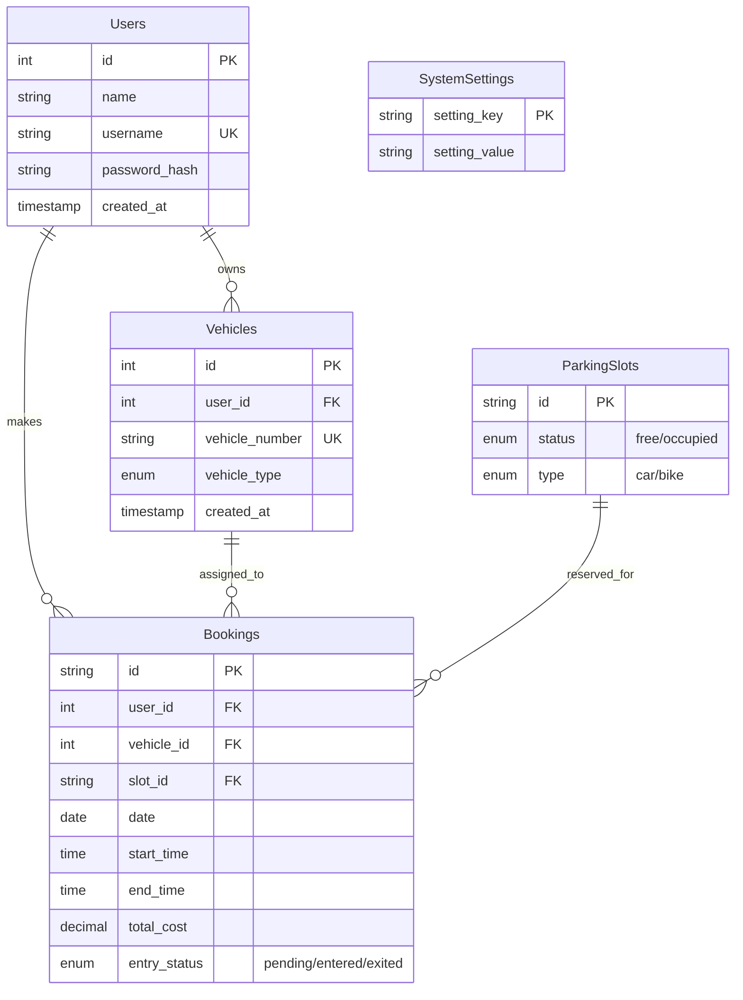

# 🚗 Smart Parking System - Project Report

## 1. Executive Summary
The **Smart Parking System** is a full-stack web application designed to streamline the process of finding and booking parking slots. It provides a real-time interface for users to book slots and an administrative dashboard for system management, fee configuration, and entry verification.

---

## 2. Technical Stack
| Layer | Technology |
| :--- | :--- |
| **Frontend** | HTML5, Vanilla CSS3, JavaScript (ES6+) |
| **Backend** | Node.js, Express.js |
| **Database** | MySQL (Hosted on Aiven.io) |
| **Deployment** | Render.com (Web Service), GitHub (CI/CD) |
| **Security** | SSL/TLS for Database, Environment Variables for Credentials |

---

## 3. System Architecture
The application follows a **Client-Server-Database** architecture:
1.  **Client**: A responsive frontend that communicates with the backend via RESTful APIs. It automatically detects environment (local vs. production) to route requests.
2.  **Server**: A Node.js Express server that serves static files and handles business logic, including authentication, slot management, and booking transactions.
3.  **Database**: A hosted MySQL instance that maintains persistent data for users, vehicles, slots, and bookings.

---

## 4. Entity-Relationship (ER) Diagram
The database consists of 5 core tables. Below is the visual representation of the data model:

---

## 5. Key Features
### 👤 User Features
*   **Real-Time Dashboard**: Visual map of parking slots with status indicators.
*   **Dynamic Booking**: Automated cost calculation based on duration and hourly rates.
*   **Vehicle Management**: Users can register multiple vehicles (Cars/Bikes).
*   **Mobile Responsive**: Accessible from any device.

### 🛡️ Admin Features
*   **System Management**: Global configuration for parking fees.
*   **Slot Management**: Add or delete parking slots in real-time.
*   **Entry Verification**: Verify vehicle numbers against active bookings for security.
*   **Transaction Logs**: View all recent bookings and payment statuses.

---

## 6. Deployment & Scalability
The system is optimized for cloud deployment:
*   **CI/CD**: Automatic deployments from GitHub to Render.
*   **Environment Agnostic**: Uses `.env` files and dynamic API base detection.
*   **Production Ready**: Integrated SSL for secure database communication and standard SQL error handling.

---

## 7. Conclusion
The Smart Parking System successfully transitions from a local prototype to a production-ready cloud application. Its modular design allows for future enhancements such as IoT sensor integration, QR code ticket generation, and automated payment gateway integration.

---
*Generated by Antigravity AI - 2026*
